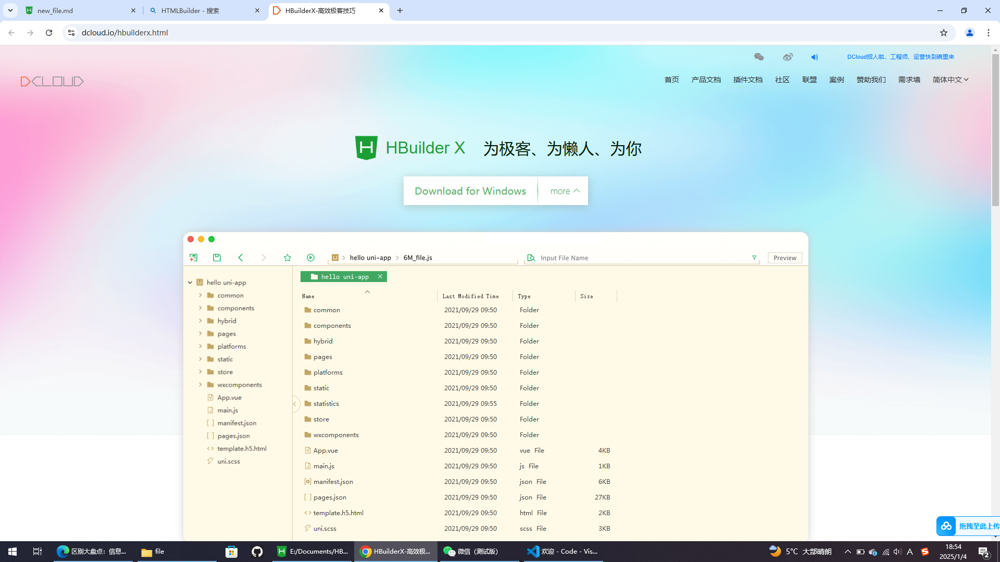
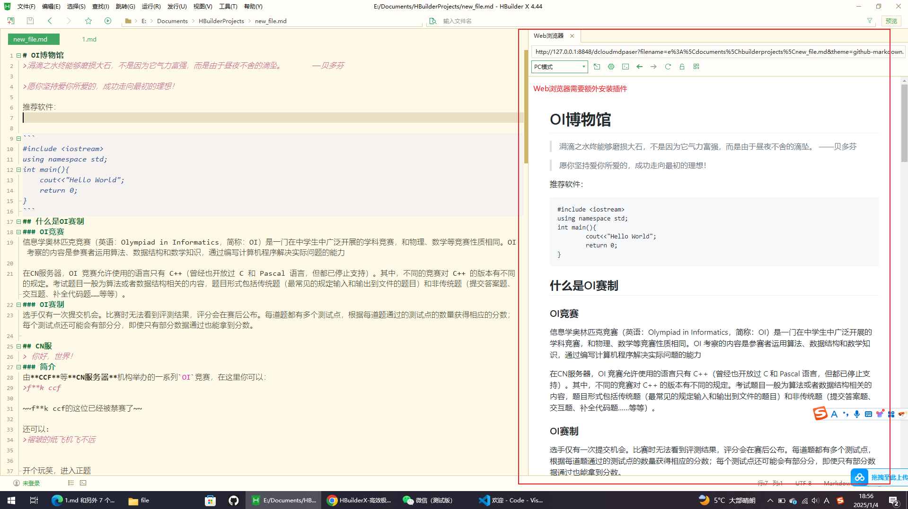
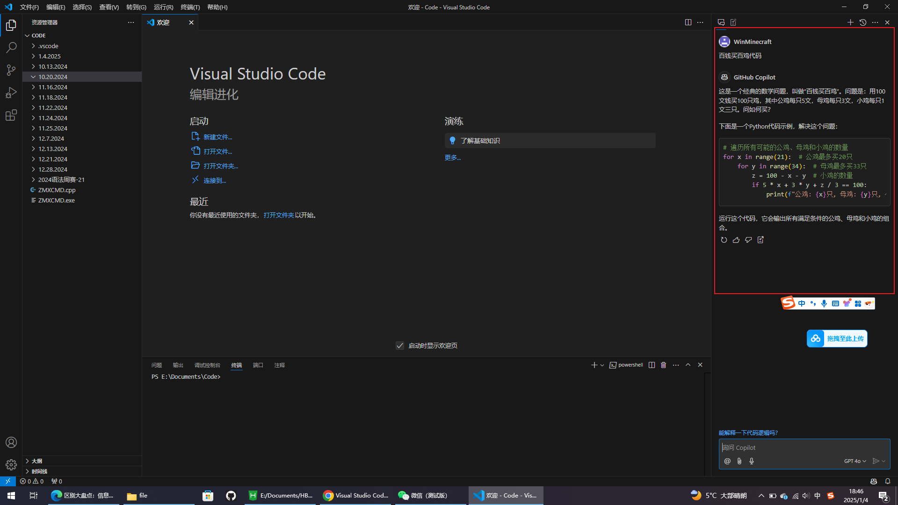
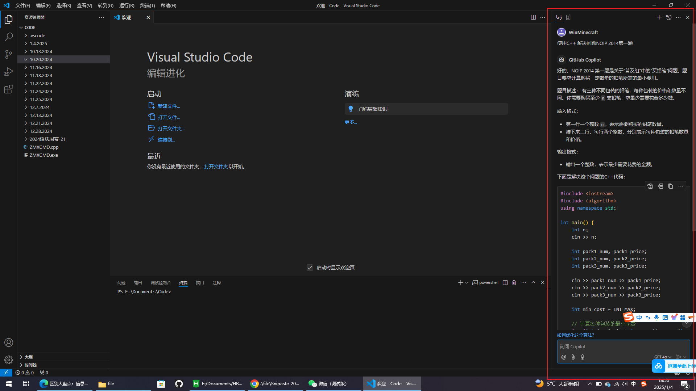
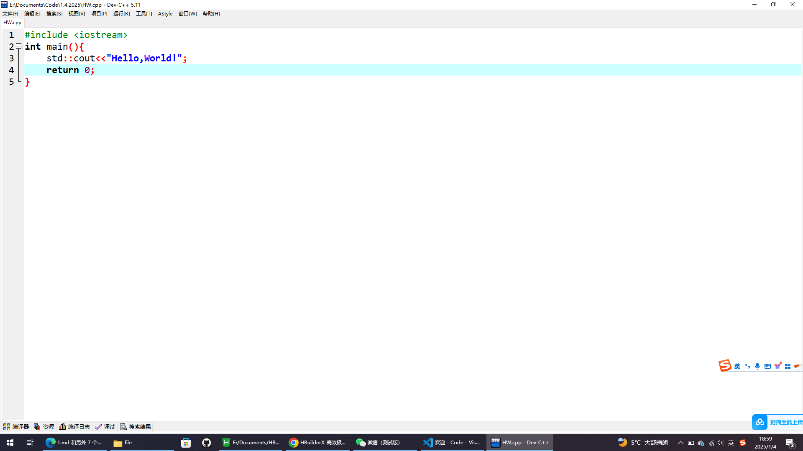
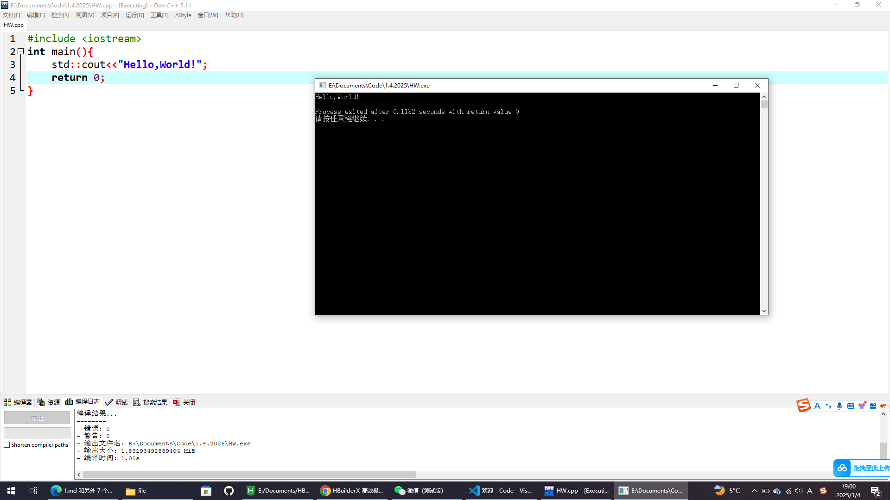

# 推荐软件
>预先善其事，必先利其器

- [HTMLBuilder](https://dcloud.io/hbuilderx.html)  
世界上第二牛逼的（编辑器？）（第一在它下面）  

~~我绝对不会告诉你，这个网页就是用HTMLBuilder写的~~

- [Microsoft Visual Studio Code](https://code.visualstudio.com/)  

地表最强IDE，不得不说，Visual Studio Code的AI真不错

- [Dev C++](https://sourceforge.net/projects/orwelldevcpp/)

一个轻量级IDE，虽然老了点，但对于OI党来说，足够了！

